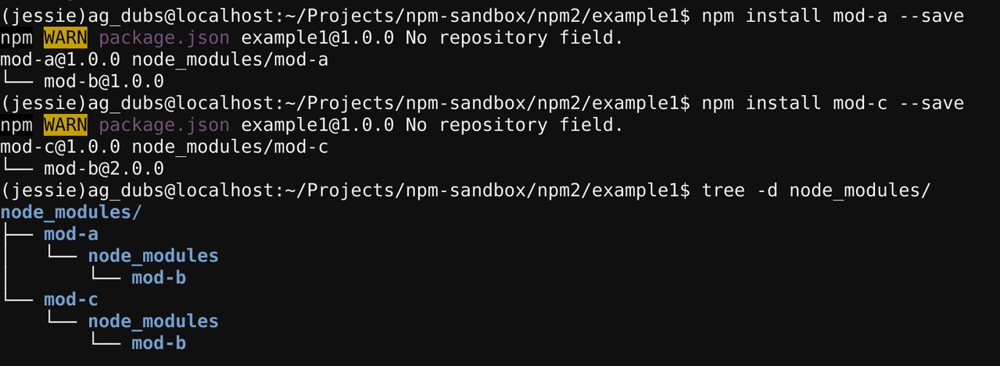

# npm2 - example1

## Up and Running

```
$ npm install -g npm@2
$ npm -v # 2.14.15
$ npm install
```

## Explanation

Imagine there are three modules: A, B, and C. A requires
B at v1.0, and C also requires B, but at v2.0. We can
visualize this like so:


Now, let's create an application that requires both module
A and module C.


Instead of attempting to resolve module B to a single version,
npm puts both versions of module B into the tree, each version
nested under the module that requires it.


In the terminal, this looks like this:



You can list the dependencies and still see their relationships using
`npm ls`:


If you want to just see your primary dependencies, you can use:

```
npm ls --depth=0
```


